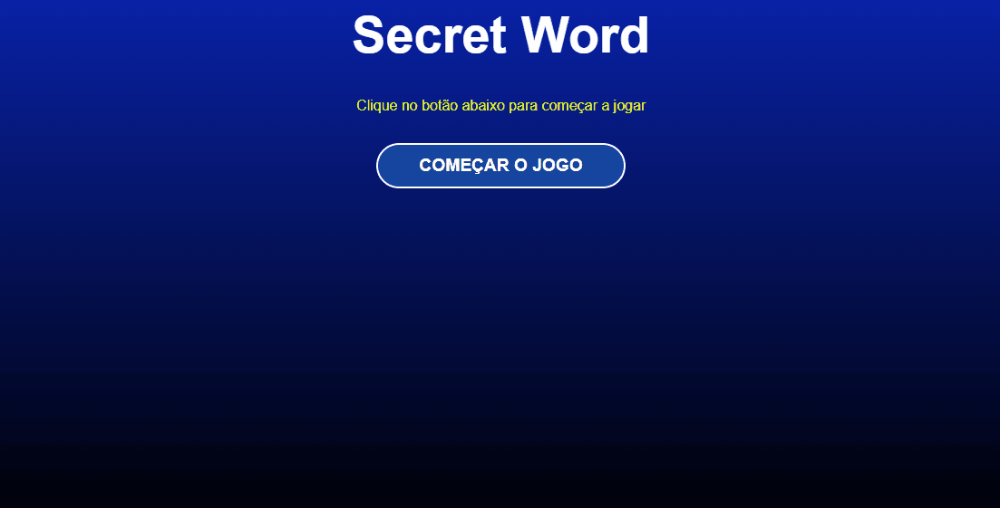

# Projeto Secret Word

## Objetivo

- Construir um jogo estilo Show do Milhão usando o React. 

<br>

## Índice 📜

#### Screenshot

#### Requisitos do Projeto

#### O Projeto

#### Tecnologias Usadas

#### Como rodar o projeto

<br>

## Screenshot 🎬

<div align='center'>

</div>

<br>

## Requisitos funcionais do Projeto 🧾

- Apresentar uma tela de início, uma tela jogo e de fim de jogo;
- Mostrar na tela de jogo a pontuação corrente, uma dica da palavra a ser adivinhada e um campo para inserir a letra;
- O usuário terá três tentativas e quando finaliza estas tentativas o jogo deverá mostrar na tela de fim de jogo a pontuação do usuário;
- O usuário poderá reiniciar o jogo.

<br>

## O Projeto 📚

Este projeto é faz parte do aprendizado em React. Por isso, mais do que uma aplicação Web este jogo foi projetado para colocar em prática os conceitos iniciais da biblioteca React. 

<br>

<br>

## Tecnologias Usadas 🛠

- React;
- JavaScript;
- Vite;
- CSS

<br>

## Como rodar o projeto 🎮

Clone o repositório
```bash
git clone https://github.com/ederhscc/project-secret-word
```

 Acesse a pasta do projeto
```bash
cd project-secret-word
```

Instalar as dependências
```bash
npm install
```

Execute a aplicação
```bash
npm run dev
```

<br>

## Autor 🧑

### Eder Henrique Santos

<br>

## Links 🔗

Deploy: 

<div align="left">

  <a href = "mailto:ederhscc@gmail.com" target="_blank">
  
  </a>
  </br>
  <a href="https://www.linkedin.com/in/eder-henrique-santos" target="_blank">
  
  </a>
  </br>

</div>